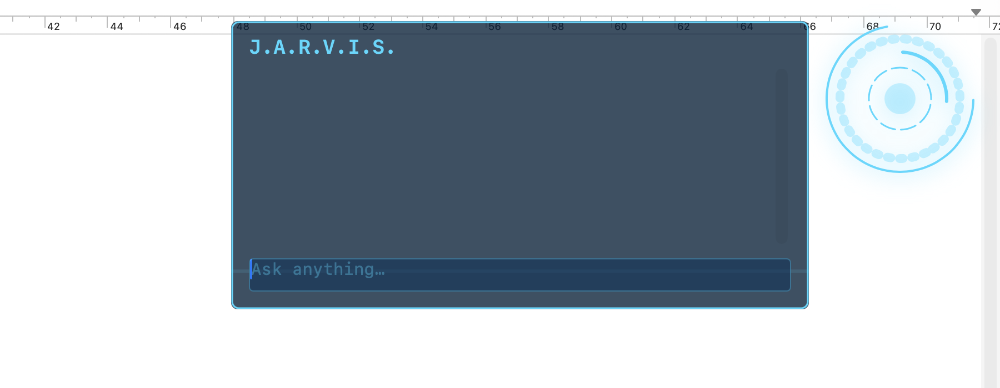
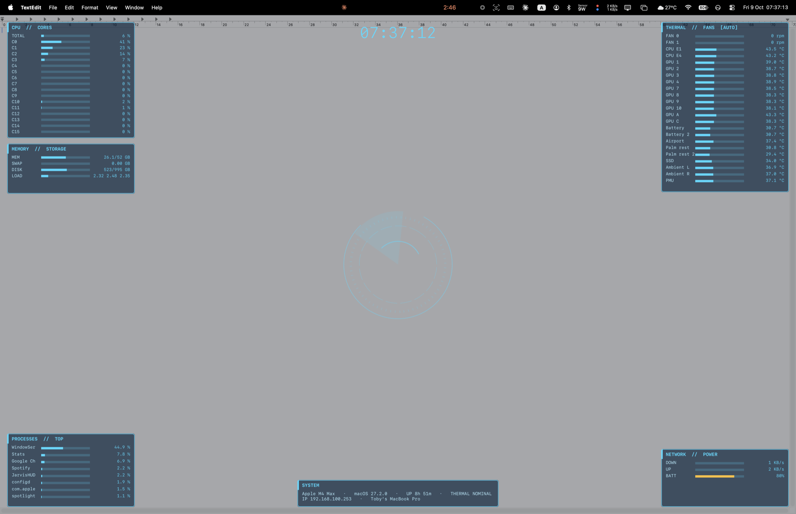

<p align="center">
  
</p>

<h1 align="center">JarvisHUD</h1>

<p align="center">
  Replace Siri on your Mac with an Iron Man <b>J.A.R.V.I.S.</b> style assistant.<br>
  Chat through <b>Groq, Gemini, OpenAI, Anthropic, OpenRouter, Ollama</b> or any OpenAI-compatible API, a live telemetry overlay with real sensor data, and fan control. All from the menu bar.
</p>

---

## What it does

| Shortcut | Action |
|---|---|
| **⌥ Space** or **F5** | Summon JARVIS. A glowing ring spins up in the top-right corner, a panel expands leftward, and you type. Press again or hit Esc to dismiss. |
| **⌃⌥ Space** | Toggle the telemetry overlay. Live stats are painted around the edges of the screen. |
| **◎ menu** | AI provider, fan control, clear conversation, quit. |

### JARVIS, in character

Replies come back the way he talks in the films: calm British butler, dry deadpan wit, "sir" when it fits, and short status-readout answers. Works with any model. Every question also carries a snapshot of your Mac's live telemetry, so you can just ask:

> *How's the machine running?*
> *Are the fans okay? Spin them up to 4000.*
> *What's eating my CPU?*

### Telemetry overlay

<p align="center">
  
</p>

Click-through, refreshed every second, and it re-fits itself when you enter or leave a full-screen app.

- **CPU** total plus every core
- **Memory, swap, disk, load average**
- **Top processes** by CPU
- **Thermal and fans** read straight from the SMC: each fan in rpm against its maximum, plus CPU, GPU, battery, SSD, ambient, PMU and palm-rest temperatures
- **Network** down and up throughput, **battery** percent and time remaining
- **System** chip, macOS version, uptime, thermal pressure, IP, hostname
- Bars turn amber past 60 percent and red past 85 percent

### Fan control

Apple Silicon fans can only be set as root, so JarvisHUD ships a tiny helper binary (`jarvisfan`) that you install once from the menu with an admin password prompt. After that:

- **◎ → Fans** gives you Automatic, fixed speeds, or Maximum
- Or ask JARVIS in plain English. He confirms in character and the app executes it.
- The overlay shows `[AUTO]` or `[MANUAL]` in the thermal card title
- Fans always return to automatic when the app quits

Speeds are clamped to the fan's own min and max as reported by the SMC.

## Install

### From the DMG

1. Download `JarvisHUD.dmg` from the [latest release](../../releases/latest).
2. Open it and drag **JarvisHUD** to **Applications**.
3. Launch it. The build is signed with a personal developer certificate, not notarized, so the first time macOS may block it: open **System Settings → Privacy & Security** and click **Open Anyway**.

### From source

```sh
git clone https://github.com/tobyyu913/JarvisHUD.git
cd JarvisHUD
./build.sh          # builds build/JarvisHUD.app
./make-dmg.sh       # optional: also packages build/JarvisHUD.dmg
open build/JarvisHUD.app
```

Needs the Xcode command line tools. Edit `SIGN` in `build.sh` to your own signing identity. Ad-hoc signing (`-`) works too, but macOS will re-ask for permissions after every rebuild because the app's identity changes.

## First-run setup

1. **Permissions.** Grant **Accessibility** and **Input Monitoring** when prompted, then quit and relaunch from the ◎ menu. This is what lets the app see the hotkey and swallow it before Siri does.
2. **AI provider.** ◎ → *AI Provider…*, pick a preset, paste your key. Groq is the default (fast and free tier friendly). Presets fill in the base URL and a sensible model; edit either freely.

   | Preset | Protocol | Default model | Key |
   |---|---|---|---|
   | Groq | OpenAI-compatible | `llama-3.3-70b-versatile` | console.groq.com/keys |
   | Gemini | Google native | `gemini-2.5-flash` | aistudio.google.com/apikey |
   | OpenAI | OpenAI | `gpt-4o-mini` | platform.openai.com |
   | Anthropic | Messages API | `claude-opus-5-5` | console.anthropic.com |
   | OpenRouter, xAI, Mistral | OpenAI-compatible | varies | their consoles |
   | Ollama, LM Studio | OpenAI-compatible, local | whatever you've pulled | none |
   | Custom | OpenAI-compatible | yours | yours |

   Anything that speaks the OpenAI `chat/completions` format works via *Custom*: just set the base URL (ending in `/v1`) and model name.
3. **Fans (optional).** ◎ → Fans → *Install Fan Control Helper…*
4. **Siri.** If you want F5 to replace Siri completely, set Siri's keyboard shortcut to *Off* in System Settings so the two don't fight.

The API key is stored in the app's own preferences on your Mac and is sent only to the provider you chose.

## Compatibility

Built and tested on an M4 Max MacBook Pro running macOS 27. It should work on any Apple Silicon Mac, but SMC temperature key names differ between chips. If some sensors are missing or look wrong on your machine, adjust the `tempKeys` list in `Sources/Stats.swift`.

## Project layout

```
Sources/main.swift      app, hotkeys, chat HUD, multi-provider AI client, JARVIS persona, fan-control bridge
Sources/Overlay.swift   edge telemetry overlay and full-screen handling
Sources/Stats.swift     SMC reader/writer, CPU/memory/disk/network/battery metrics
Helper/main.swift       jarvisfan setuid helper
build.sh                compile and sign the .app
make-dmg.sh             build and package the .dmg
```

## Credits

Visual style inspired by the J.A.R.V.I.S. interfaces in Marvel's Iron Man films. Not affiliated with Marvel, Apple, Google, Groq, OpenAI or Anthropic.
